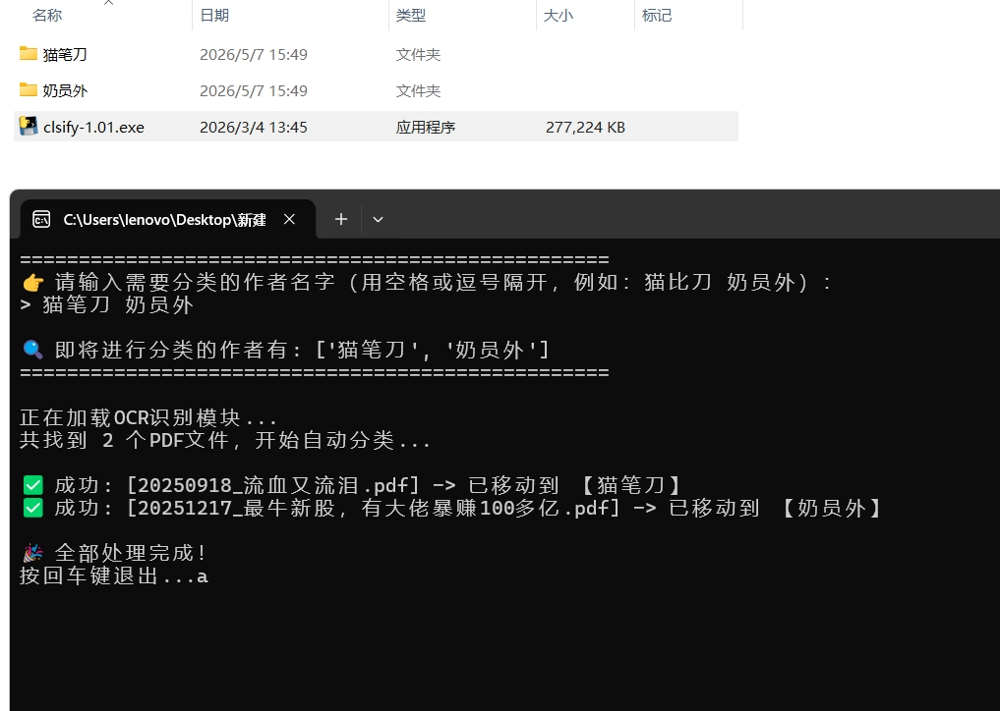

微信公众号文章PDF分类工具

# PDF 按作者自动分类工具

这是一个基于 OCR 技术的自动化脚本，专门用于处理纯图片格式的 微信公众号文章 PDF。
它可以自动识别 PDF 第一页前 1/3 的作者名字，并将文件自动归类到对应的文件夹中。

## 使用说明（小白用户）

请前往右侧的 **Releases** 页面下载打包好的 `.exe` 软件。把 `.exe` 和你的 PDF 放在同一个文件夹下，双击运行，输入作者名字即可全自动分类！

	

[详细介绍](Composition_Grid_Generator/)

## 开发者指南
1. 安装依赖：`pip install -r requirements.txt`
2. 运行脚本：`python main.py`
3. 打包成exe：`pyinstaller -F --collect-all rapidocr_onnxruntime main.py`